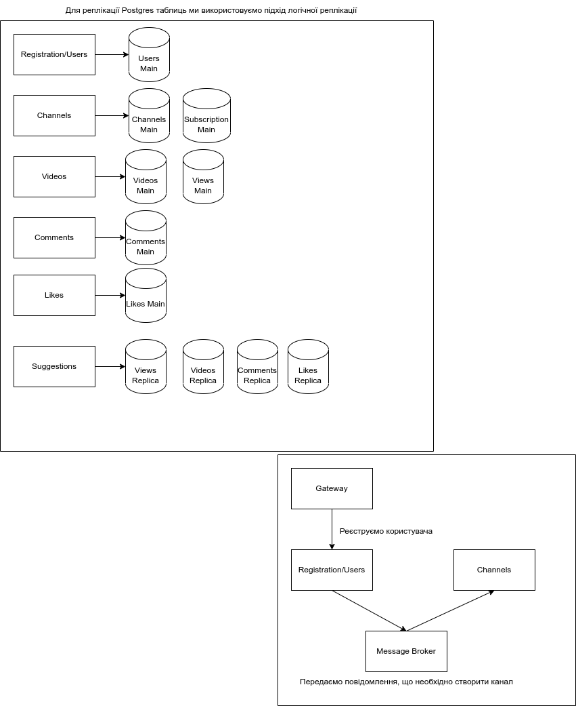

# YnotTube
YnotTube backend architecture development project for video hosting

# Architecture Diagram
## General Overview

This is a digram presenting an architecture for a piece of software meant to handle high load expected for a video hosting.

As it was expected, API server that handles requests from client is built based on microservice principles. 
Our team decided to use an internet-facing API gateway concept to act as a load balancer and API provider for app client. The gateway receives requests from the client and forwards them to respective microservices. 

There are in 6 microservices in total. They are:

 - [Users](./services/user-management.md)
 - [Channels](./services/channels.md)
 - [Videos](./services/videos.md)
 - [Comments](./services/comments.md)
 - [Likes](./services/likes.md)
 - [Suggestions](./services/suggestions.md)

Each microservice has access to its own instance of database and cache.

Apart from API server, It's also important to emphasize on additional elements such as Video Hosting which is used for storing and serving videos and CDN that is used to cache popular content.

## Interservice Communication

Regular YnotTube operations require microservices to be able to communicate between themselves. To achieve that, we chose two-fold approach.

Firstly, to cover information that one service occasionally has to get from another we decided to use logical database replication. It works via publishing data stored in microservice database to databases of microservices that might need it. This approach avoids querying data from microservices over the network. Additionally, eliminating these requests mean that database used by those services avoids addtional calls. As our system is read-heavy, this approach should help deal with the load.

Secondly, microservices communicate actions that generate data and do not require response through message brokers. Example of such actions would be a request to create user, which then disseminates message to create new channel via broker. Channel microservice receives the message and completes the action, while user service returns response immediately.

## System monitoring

For system monitoring is highly dependant on systems used, that why we chose a monitoring systems that fits our requirements. The following image provides usage explanation for our design.

We use a Prometheus-Loki-Grafana trio for logs and metrics. These instruments are easily integrated in different scaling managment systems so they will be able to provide us a certain flexibility of choice. 

Metrics monitoring uses a pull system imposed by Prometherus. It allows not only connection to our microservices, but also databases, cache, API gateways and other third party systems. 

Log collection is happening via Loki log aggregation system. Every system component that is meant to generate logs send them to Loki using Promtail agent, then Loki uses grafana display to display those logs.

## Dependencies

A list of dependencies for this project:
 - Database - PostgreSQL
 - Microservice Cache - Redis
 - Message Broker for microservices - RabbitMQ
 - Email delivery api - Mailgun
 - Load Balancer and API Gateway - Nginx
 - Content Delivery Network - CloudFlare
 - Videos Search engine - Elastic Search
 - Video hosting service - AWS S3
 - Metrics monitoring - Prometheus
 - Logs aggregation - Loki
 - Data visualisation and log querying - Grafana

## Database Schema

